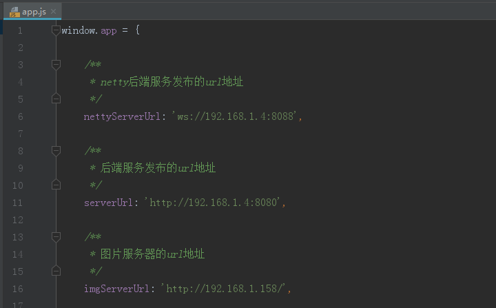
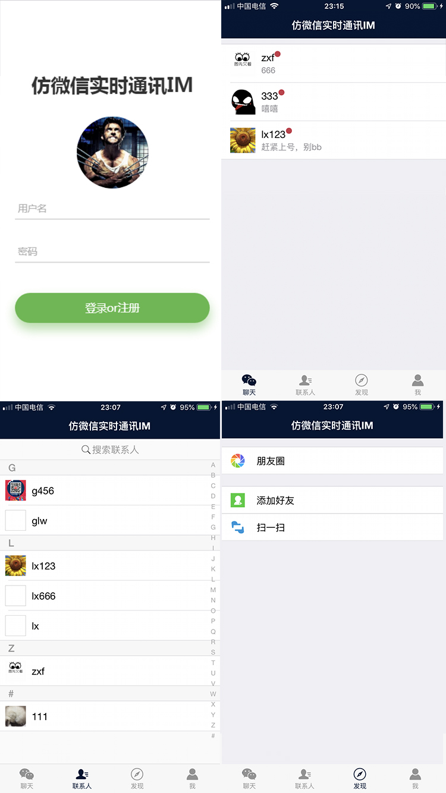
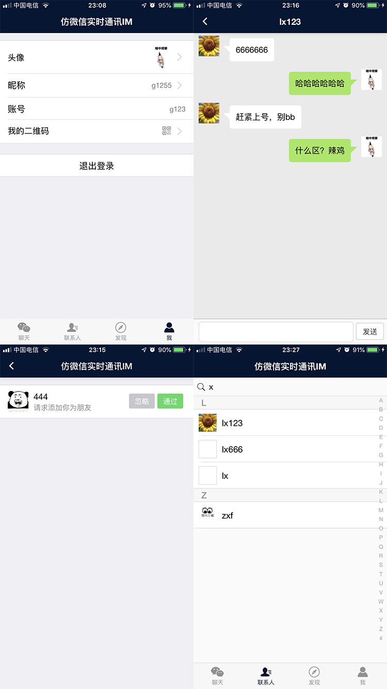
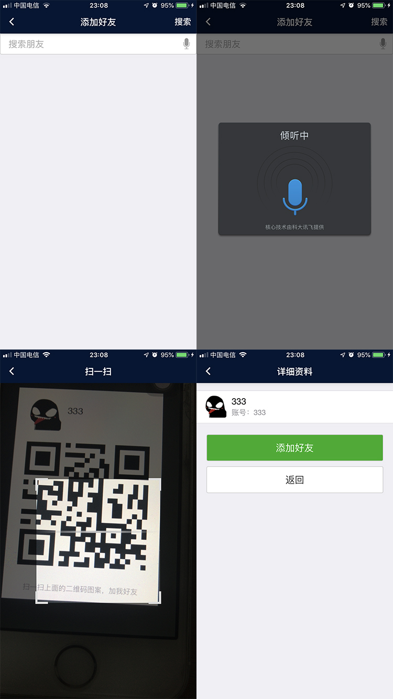
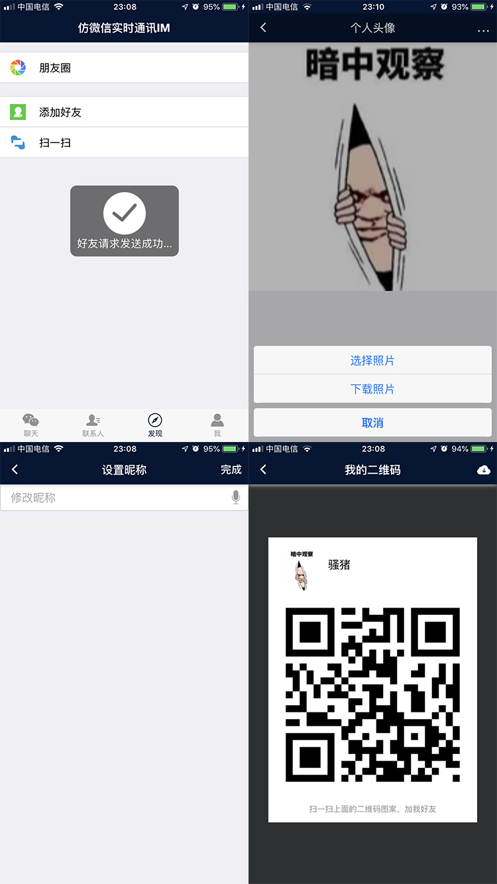

<h1>
跨平台仿微信即时通讯聊天app
</h1>

如果本项目对你有用，还请在项目右上角点个star，谢谢大佬支持。

# 作品简介

本项目采用前后端分离开发，面向restful风格的接口编程。

前端可跨平台在android和ios设备上运行，图片服务器用的fastdfs统一管理app内图片，登录以及消息转发服务器采用netty+springboot，快速高效开发的同时，服务能承受大量在线同时进行聊天的后台，采用nginx进行反向转发代理，提高服务器稳定性。

采用docker容器方式部署，隔离开发与测试环境不一致问题。

# 涉及技术框架

后端：

- Netty
- SpringBoot
- Nginx+FastDFS分布式文件系统
- Mybatis
- lombok + slf4j
- swagger

后端项目：[传送门](https://github.com/DragonV96/ichat-server)

前端：

- MUI
- H5Plus（H5+）

前端项目：[传送门](https://github.com/DragonV96/ichat-weixin)

# 环境参数

- 基础工具 maven3+、jdk8、tomcat8
- 开发工具 IDEA(或STS，或Eclipse，建议IDEA)
- 核心框架 SpringBoot2.0、Netty 4.1
- 持久层 MyBatis3.4.5
- 数据库 MariaDB/mysql HikariCP 2.7.9
- 文件服务器 nginx 1.12.0 fastdfs 5.05
- 前端框架 MUI H5plus
- 简化对象封装工具Lombok

# 实现功能

前端可跨平台在web，android，ios等设备上运行，后端采用netty，可承受大量在线用户。

- 用户登录注册，退出登录（缓存登录状态，下次打开时无需再次登录）
- 用户头像的上传与下载
- 用户昵称更改
- 用户二维码展示
- 用户扫一扫添加好友，搜索账号添加好友
- 联系人列表，可搜索联系人
- 实时聊天消息的接收与发送，聊天记录本地缓存
- 聊天页面左滑删除聊天记录
- 心跳检测机制

# 搭建流程

1）下载**最新版**HbuilderX：[传送门](https://www.dcloud.io/)（一定要最新，否则可能会出现一些奇怪的bug）。

2）直接选择打开项目。

3）将 `/js/app.js` 文件中的地址和端口修改为自己服务端地址和端口即可运行，如图

# 界面展示

